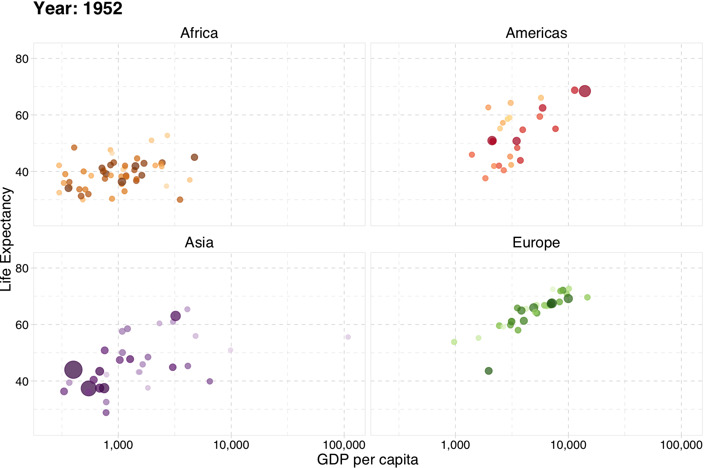

class: inverse, middle

```{r Setup, include = F}
options(htmltools.dir.version = FALSE)
library(pacman)
p_load(leaflet, ggplot2, ggthemes, viridis, dplyr, magrittr, knitr)
# Define pink color
red_pink <- "#e64173"
# Notes directory
dir_slides <- "~/Dropbox/UO/Teaching/EC421W22/notes/01-intro/"
# Knitr options
opts_chunk$set(
  comment = "#>",
  fig.align = "center",
  fig.height = 7,
  fig.width = 10.5,
  # dpi = 300,
  # cache = T,
  warning = F,
  message = F
)
# A few extras
xaringanExtra::use_xaringan_extra(c("tile_view", "fit_screen"))
```

# Prologue

---
# Why?

## Motivation

Let's start with a few __basic, general questions:__

--

1. What is the goal of econometrics?

2. Why do economists (or other people) study or use econometrics?

--

__One simple answer:__ Learn about the world using data.

--

- _Learn about the world_ = Raise, answer, and challenge questions, theories, assumptions.

- _data_ = Plural of datum.

---
# Why?

## Example

One might (reasonably) guess a company's .purple[sales] are a function of its .pink[advertising spending, price, and intesity of competitors].

--

So, one might hypothesize a model $\color{#6A5ACD}{\text{Sales}} = f(\color{#e64173}{\text{Ad}, \text{Price}, \text{Comp}})$

where

- $\color{#e64173}{\text{Ad}}$ represents dollars spent on advertising,
- $\color{#e64173}{\text{Price}}$ is the product's price,
- $\color{#e64173}{\text{Comp}}$ gives the product's competition.

--

We expect that .purple[sales] $\uparrow$ with .pink[advertising] and $\downarrow$ with .pink[price] and .pink[competition].

---
class: clear, middle

But who needs to .grey[_expect_]?

We can .orange[_test_] these hypotheses __using regression__.

.white[
_More importantly:_ Regression estimates the _size_ of these effects

- *How much* does an additional dollar of advertising increase sales?
- *How much* does a one-dollar increase in price decrease sales?
- *How much* does an additional competitor reduce sales?

These (causal) questions are central to efficient decision-making<br>and are the bread and butter of econometrics.
]


---
class: clear, middle

But who needs to .grey[_expect_]?

We can .orange[_test_] these hypotheses __using regression__.

.grey-vlight[_More importantly:_] Regression estimates the .orange[_size_] of these effects

- *How much* does an additional dollar of .pink[advertising] increase .purple[sales]?
- *How much* does a one-dollar increase in .pink[price] decrease .purple[sales]?
- *How much* does an additional .pink[competitor] reduce .purple[sales]?

These (causal) questions are central to efficient decision-making<br>and are the bread and butter of econometrics.

---
layout: true
# Why?

## Example, cont.

__Regression model:__

$$ \color{#6A5ACD}{\text{Sales}}_i = \beta_0 + \beta_1 \color{#e64173}{\text{Ad}}_i + \beta_2 \color{#e64173}{\text{Price}}_i + \beta_3 \color{#e64173}{\text{Comp}}_i + \varepsilon_i $$

---

With this basic regression model, we can test/estimate/quantify the (linear) relationship between sales and advertising, price, and competition.

---

### (Review) Questions

--

- __Q:__ How do we interpret $\beta_1$?
--

- __A:__ An additional dollar of .pink[advertising] corresponds with a $\beta_1$-unit change in .purple[sales] (holding .pink[price] and .pink[competition] fixed).

---

### (Review) Questions

- __Q:__ Are the $\beta_k$ terms population parameters or sample statistics?
--

- __A:__ Greek letters denote __population parameters__. Their estimates get hats, _e.g._, $\hat{\beta}_k$. Population parameters represent the __average__ behavior across the population.

---

### (Review) Questions

- __Q:__ Can we interpret the estimates for $\beta_2$ as causal?
--

- __A:__ Not without making more assumptions and/or knowing more about the data-generating process.

---

### (Review) Questions

- __Q:__ What is $\varepsilon_i$?
--

- __A:__ An individual's random deviation/disturbance from the population parameters.

Population parameters are averages; individuals are rarely average.

---

### (Review) Questions

- __Q:__ Which assumptions do we impose when estimating with OLS?
--

- __A:__
  - The relationship between the sales and the .pink[explanatory variables] is linear in parameters, and $\varepsilon$ enters additively.
  - The .pink[explanatory variables] are __exogenous__, _i.e._, $E[\varepsilon|X] = 0$.
  - You've also typically assumed something along the lines of:<br> $E[\varepsilon_i] = 0$, $E[\varepsilon_i^2] = \sigma^2$, $E[\varepsilon_i \varepsilon_j] = 0$ for $i \neq j$.
  - And (maybe) $\varepsilon_i$ is distributed normally.

---
layout: false

# Assumptions

## How important can they be?

You've learned how **powerful and flexible** ordinary least squares (**OLS**) regression can be.

--

However, the results you learned required assumptions.

--

**Real life often violates these assumptions.**

---
class: clear, middle

EC421 asks "**What happens when we violate these assumptions?**"
- Can we find a fix? (Especially: How/when is $\beta$ *causal*?)
- What happens if we don't (or can't) apply a fix?

OLS still does some amazing things—but you need to know when to be **cautious, confident, or dubious**.

---

# Not everything is causal

```{r, spurious, echo = F, dev = "svg"}
tmp <- data.frame(
  year = 1999:2009,
  count = c(
    9, 8, 11, 12, 11, 13, 12, 9, 9, 7, 9,
    6, 5, 5, 10, 8, 14, 10, 4, 8, 5, 6
  ),
  type = rep(c("letters", "deaths"), each = 11)
)
ggplot(data = tmp, aes(x = year, y = count, color = type)) +
  geom_path() +
  geom_point(size = 4) +
  xlab("Year") +
  ylab("Count") +
  scale_color_manual(
    "",
    labels = c("Deaths from spiders", "Letters in the winning spelling bee word"),
    values = c(red_pink, "darkslategray")
  ) +
  theme_pander(base_size = 17) +
  theme(legend.position = "bottom")
```

---
# Not everything is causal
## More seriously

Suppose you estimate our sales model for your boss.

$$ \color{#6A5ACD}{\text{Sales}}_i = \hat{\beta}_0 + \hat{\beta}_1 \color{#e64173}{\text{Ad}}_i + \hat{\beta}_2 \color{#e64173}{\text{Price}}_i + \hat{\beta}_3 \color{#e64173}{\text{Comp}}_i + e_i $$

Can you trust that $\hat{\beta}_2$ gives you the actual effect of .pink[price] on .purple[sales]?

---

# Econometrics

Applied econometrics, data science, analytics require:

1. Intuition for the __theory__ behind statistics/econometrics<br>(assumptions, results, strengths, weaknesses).

1. Practical knowledge of how to __apply theoretical methods__ to data.

1. Efficient methods for __working with data__<br>(cleaning, aggregating, joining, visualizing).

--

__This course__ aims to deepen your knowledge in each of these three areas.

--

- 1: As before.
- 2–3: __R__

---
class: inverse, middle
# R

---
layout: true
# R

---

## What is R?

To quote the [R project website](https://www.r-project.org):

> R is a free software environment for statistical computing and graphics. It compiles and runs on a wide variety of UNIX platforms, Windows and MacOS.

--

What does that mean?

- R was created for the statistical and graphical work required by econometrics.

- R has a vibrant, thriving online community. ([stack overflow](https://stackoverflow.com/questions/tagged/r))

- Plus it's __free__ and __open source__.

---

## Why are we using R?

1\. R is __free__ and __open source__—saving both you and the university 💰💵💰.

2\. _Related:_ Outside of a small group of economists, private- and public-sector __employers favor R__ over .mono[Stata] and most competing softwares.

3\. R is very __flexible and powerful__—adaptable to nearly any task, _e.g._, 'metrics, spatial data analysis, machine learning, web scraping, data cleaning, website building, teaching. My website, the TWEEDS website, and these notes all came out of R.

---

## Why are we using R?

4\. _Related:_ R imposes __no limitations__ on your amount of observations, variables, memory, or processing power. (I'm looking at __you__, .mono[Stata].)

5\. If you put in the work,<sup>†</sup> you will come away with a __valuable and marketable__ tool.

6\. I 💖 __R__


.footnote[
[†]: Learning R definitely requires time and effort.
]

---
```{r, statistical languages, echo = F, fig.height = 6, fig.width = 9, dev = "svg"}
# The popularity data
pop_df <- data.frame(
  lang = c("SQL", "Python", "R", "SAS", "Matlab", "SPSS", "Stata"),
  n_jobs = c(107130, 66976, 48772, 25644, 11464, 3717, 1624),
  free = c(T, T, T, F, F, F, F)
)
pop_df %<>% mutate(lang = lang %>% factor(ordered = T))
# Plot it
ggplot(data = pop_df, aes(x = lang, y = n_jobs, fill = free)) +
geom_col() +
geom_hline(yintercept = 0) +
aes(x = reorder(lang, -n_jobs), fill = reorder(free, -free)) +
xlab("Statistical language") +
scale_y_continuous(label = scales::comma) +
ylab("Number of jobs") +
ggtitle(
  "Comparing statistical languages",
  subtitle = "Number of job postings on Indeed.com, 2019/01/06"
) +
scale_fill_manual(
  "Free?",
  labels = c("True", "False"),
  values = c(red_pink, "darkslategray")
) +
theme_pander(base_size = 17) +
theme(legend.position = "bottom")
```

---

layout: false
class: inverse, middle
# R + Examples

---

# R + Regression

```{r, example: lm}
# A simple regression
{{fit <- lm(dist ~ 1 + speed, data = cars)}}
# Show the coefficients
coef(summary(fit))
# A nice, clear table
library(broom)
tidy(fit)
```

---

# R + Plotting (w/ .mono[plot])

```{r, example: plot, echo = F, dev = "svg"}
# Load packages with dataset
library(gapminder)
# Create dataset
plot(
  x = gapminder$gdpPercap, y = gapminder$lifeExp,
  xlab = "GDP per capita", ylab = "Life Expectancy"
)
```

---

# R + Plotting (w/ .mono[plot])

```{r, example: plot code, eval = F}
# Load packages with dataset
library(gapminder)

# Create dataset
plot(
  x = gapminder$gdpPercap, y = gapminder$lifeExp,
  xlab = "GDP per capita", ylab = "Life Expectancy"
)
```

---

# R + Plotting (w/ .mono[ggplot2])

```{r, example: ggplot2 v1, echo = F, dev = "svg"}
# Load packages
library(gapminder); library(dplyr)
# Create dataset
ggplot(data = gapminder, aes(x = gdpPercap, y = lifeExp)) +
geom_point(alpha = 0.75) +
scale_x_continuous("GDP per capita", label = scales::comma) +
ylab("Life Expectancy") +
theme_pander(base_size = 16)
```

---

# R + Plotting (w/ .mono[ggplot2])

```{r, example: ggplot2 v1 code, eval = F}
# Load packages
library(gapminder); library(dplyr)

# Create dataset
ggplot(data = gapminder, aes(x = gdpPercap, y = lifeExp)) +
geom_point(alpha = 0.75) +
scale_x_continuous("GDP per capita", label = scales::comma) +
ylab("Life Expectancy") +
theme_pander(base_size = 16)
```

---

# R + More plotting (w/ .mono[ggplot2])

```{r, example: ggplot2 v2, echo = F, dev = "svg"}
# Load packages
library(gapminder); library(dplyr)
# Create dataset
ggplot(
  data = filter(gapminder, year %in% c(1952, 2002)),
  aes(x = gdpPercap, y = lifeExp, color = continent, group = country)
) +
geom_path(alpha = 0.25) +
geom_point(aes(shape = as.character(year), size = pop), alpha = 0.75) +
scale_x_log10("GDP per capita", label = scales::comma) +
ylab("Life Expectancy") +
scale_shape_manual("Year", values = c(1, 17)) +
scale_color_viridis("Continent", discrete = T, end = 0.95) +
guides(size = F) +
theme_pander(base_size = 16)
```

---

# R + More plotting (w/ .mono[ggplot2])

```{r, example: ggplot2 v2 code, eval = F}
# Load packages
library(gapminder); library(dplyr)

# Create dataset
ggplot(
  data = filter(gapminder, year %in% c(1952, 2002)),
  aes(x = gdpPercap, y = lifeExp, color = continent, group = country)
) +
geom_path(alpha = 0.25) +
geom_point(aes(shape = as.character(year), size = pop), alpha = 0.75) +
scale_x_log10("GDP per capita", label = scales::comma) +
ylab("Life Expectancy") +
scale_shape_manual("Year", values = c(1, 17)) +
scale_color_viridis("Continent", discrete = T, end = 0.95) +
guides(size = F) +
theme_pander(base_size = 16)
```

---

# R + Animated plots (w/ .mono[gganimate])

```{r, example: gganimate, include = F, cache = T, eval = F}
# The package for animating ggplot2
library(gganimate)
# As before
gg <- ggplot(
  data = gapminder %>% filter(continent != "Oceania"),
  aes(gdpPercap, lifeExp, size = pop, color = country)
) +
geom_point(alpha = 0.7, show.legend = FALSE) +
scale_colour_manual(values = country_colors) +
scale_size(range = c(2, 12)) +
scale_x_log10("GDP per capita", label = scales::comma) +
facet_wrap(~continent) +
theme_pander(base_size = 16) +
theme(panel.border = element_rect(color = "grey90", fill = NA)) +
# Here comes the gganimate-specific bits
labs(title = "Year: {frame_time}") +
ylab("Life Expectancy") +
transition_time(year) +
ease_aes("linear")
# Save the animation
anim_save(
  animation = gg,
  filename = "ex_gganimate.mp4",
  path = dir_slides,
  width = 10.5,
  height = 7,
  units = "in",
  res = 150,
  nframes = 56
)
```

.center[]

---

# R + Animated plots (w/ .mono[gganimate])

```{r, example: gganimate code, eval = F}
# The package for animating ggplot2
library(gganimate)
# As before
ggplot(
  data = gapminder %>% filter(continent != "Oceania"),
  aes(gdpPercap, lifeExp, size = pop, color = country)
) +
geom_point(alpha = 0.7, show.legend = FALSE) +
scale_colour_manual(values = country_colors) +
scale_size(range = c(2, 12)) +
scale_x_log10("GDP per capita", label = scales::comma) +
facet_wrap(~continent) +
theme_pander(base_size = 16) +
theme(panel.border = element_rect(color = "grey90", fill = NA)) +
# Here comes the gganimate-specific bits
labs(title = "Year: {frame_time}") +
ylab("Life Expectancy") +
transition_time(year) +
ease_aes("linear")
```

---

# R + Maps

```{r, example: leaflet, fig.height = 6, dev = "svg"}
library(leaflet)
leaflet() %>%
  addTiles() %>%
  addMarkers(lng = -123.075, lat = 44.045, popup = "The University of Oregon")
```

---
class: inverse, middle
# Getting started with R

---
layout: true
# Starting R

---

## Installation

- Install [R](https://www.r-project.org/).

- Install [.mono[RStudio]](https://www.rstudio.com/products/rstudio/download/preview/).

- __Optional/Overkill:__ [Git](https://git-scm.com/downloads)
  - Create an account on [GitHub](https://github.com/)
  - Register for a student/educator [discount](https://education.github.com/discount_requests/new).
  - For installation guidance and troubleshooting, check out Jenny Bryan's [website](http://happygitwithr.com/).

- __Note:__ Many UO labs have R installed and ready. That said, having a copy of R on your own computer will likely be very convenient for homework, projects, _etc._

---

## Resources

### Free(-ish)

- Google (which inevitably leads to StackOverflow)
- Time
- ChatGPT, Copilot, and other AI assistants
- Your classmates
- Your GEs
- Me
- R resources [here](http://edrub.in/ARE212/resources.html) and [here](https://www.rstudio.com/online-learning/)

### Money

- Book: [_R for Stata Users_](http://r4stats.com/books/r4stata/)
- Short online course: [DataCamp](https://www.datacamp.com)

---

## Some R basics

You will dive deeper into R in lab, but here six big points about R:

.more-left[

1. Everything is an __object__.

1. Every object has a __name__ and __value__.

1. You use __functions__ on these objects.

1. Functions come in __libraries__ (__packages__)

1. R will try to __help__ you.

1. R has its __quirks__.

]

.less-right[

`foo`

`foo = 2`

`mean(foo)`

`library(dplyr)`

`?dplyr`

`NA; error; warning`

]

---
exclude: true

## R _vs._ .mono[Stata]

Coming from .mono[Stata], here are a few important changes (benefits):

- Multiple objects and arrays (_e.g._, data frames) can exist in the same workspace (in memory). No more `keep`, `preserve`, `restore`, `snapshot` nonsense!

- (Base) R comes with lots of useful built-in functions—and provides all the tools necessary for you to build your own functions. However, many of the _best_ functions come from external libraries.

- You don't need to `tset` or `xtset` data (you can if you really want... `ts`).

---
layout: false
class: inverse, middle

# Next: (More) Metrics review(s)

---
exclude: true

```{r, build pdfs, include = F, eval = F}
xaringanBuilder::build_pdf('01-intro.html')
# pagedown::chrome_print(input = "01-intro.html")
```
